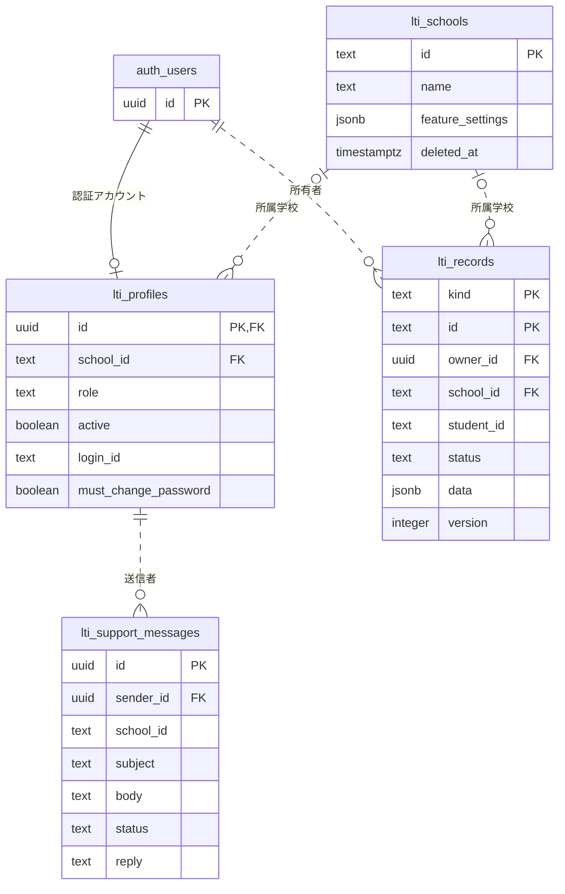
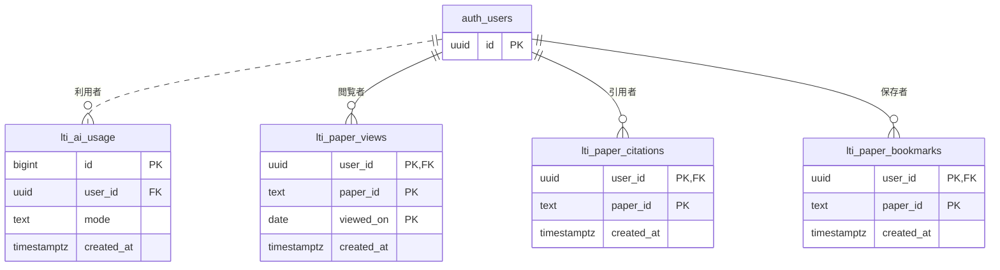
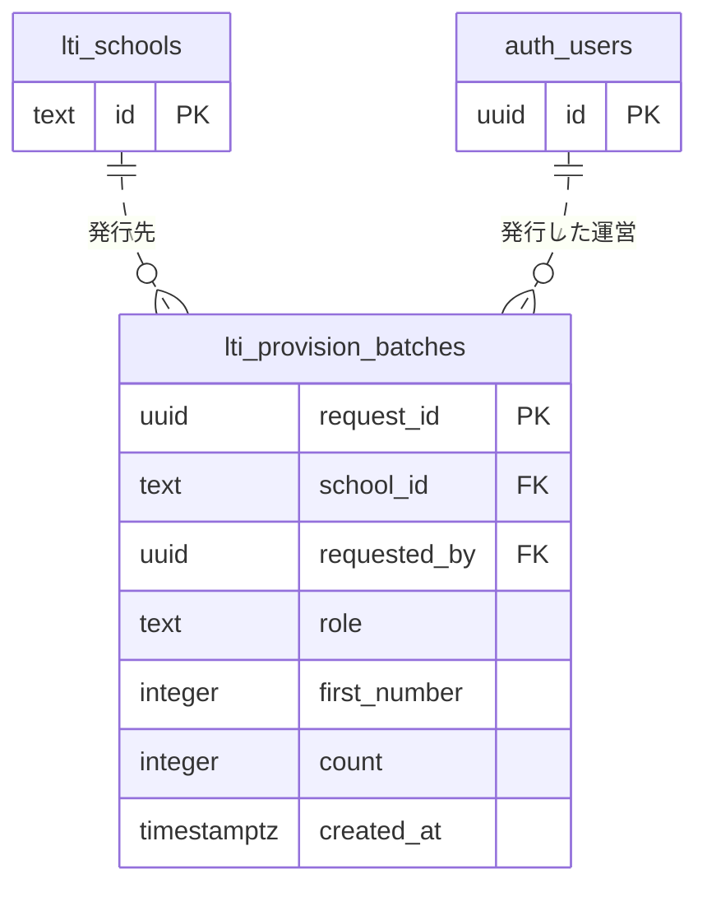

# LTI Explore 本番DBのER図

取得日: 2026-10-03（日本時間）。対象: 本番Supabaseのpublicスキーマにあるlti_実テーブル9個。information_schema.columnsとpg_constraintから列・主キー・外部キーを読み取った。秘密鍵、パスワード、利用者や論文の実データはこの記録に含めない。

PKは主キー、FKはDBで宣言された外部キー。図の線は実際のFKだけを表す。実線はFKが子側の主キーに含まれる関係、点線は含まれない関係。アプリがJSONや文字列で関連づけるものは、後半の対応表で分けて記載する。

## 学校・利用者・研究データ・運営への連絡

運営アカウントなど、所属学校を持たないプロフィールやレコードがあるため、school_idはNULLを許す。プロフィールのidはauth.users.idと共通で、認証アカウントにつきプロフィールは最大1件。

論文・課題・提出物等は別々の実テーブルではなく、lti_recordsのkindとdataで管理する。論文のAI解析はdata.aiAnalysis、解析状態はdata.aiState、原稿の保存先はdata.storagePathに入る。AI解析専用の実テーブルはない。

## 閲覧・引用・ブックマーク・AI利用回数

paper_idはlti_recordsのkind='papers'のidと対応するが、DBの外部キーは宣言されていない。操作時にはlti_can_access_paper等のRPCで論文の存在・閲覧権限を確認する。user_idのFKだけにON DELETE CASCADEがあり、認証ユーザーを物理削除すると関連行も削除される。学校や利用者の通常の運用停止は論理削除で扱う。

## ID一括発行の予約

request_idで同じ発行依頼の二重処理を防ぎ、学校単位の番号を予約する。UI側は最大1,000人を10人ずつ発行する。

## FKではない対応関係

| 保存値 | 対応先・用途 | 保護の方法 |
| --- | --- | --- |
| lti_records.data.storagePath | Storageのlti-documents内のオブジェクト名 | Storageポリシーと認証付き取得。DBのFKではない |
| lti_records.student_id | 提出・フィードバック対象の利用者ID | text列。読取・保存RPCで学校・本人を判定。FKではない |
| lti_paper_*のpaper_id | lti_records(kind='papers',id) | RPCで論文の存在・参照権限を判定。FKではない |
| lti_support_messages.school_id | 送信時の所属学校 | 送信トリガーがプロフィールから設定。FKではない |
| lti_support_messages.school_name等 | 送信時の表示情報 | トリガーが学校名・送信者名・役割を保存するスナップショット |
| lti_records.data.aiAnalysis / aiState | 保存済みAI結果・解析状態 | レコード内のJSON。新しい解析依頼と閲覧を区別する |

ER図は構造を表し、アクセス権限そのものは表さない。RLS、列単位の権限、RPC、MFA・セッション確認と併せて点検する。

## 全列と制約の参照

全9テーブルの列名・型・NULL可否、主キー・外部キーの定義は [取得したスキーマ](database-schema.json) に保存している。auth.usersやStorage内部の全スキーマは取得対象外で、図には参照先として必要なidだけを表示した。

- [現在のリリース状況](../RELEASE_STATUS.md)
- [本番点検記録](production-readiness.md)
